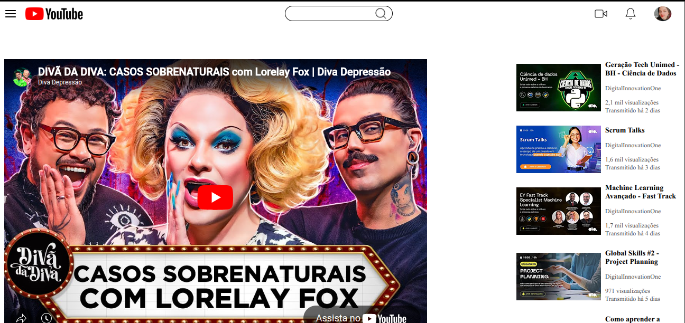

# YouTube Clone - HTML Semântico + CSS Flexbox

---

*Clone da interface do YouTube com responsividade*

---

## 🚀 Tecnologias Utilizadas

  
   

---

## 🔍 Sobre o Projeto
Recriação responsiva da interface do YouTube utilizando:
- **HTML semântico** - tags estruturais adequadas
- **CSS Flexbox** - para layout
- **Media Queries** - para responsividade

## 🔗 https://maarivalentim.github.io/-clonando-a-pagina-do-youtube-com-css/:
  

